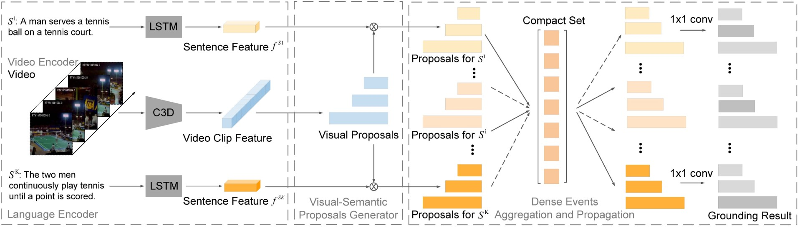

<!-- 
<i><strong>A</strong></i>  
<strong>B</strong>, C  
<i>D</i>,  
[[E]()]   
 
F
-->

 
<strong>Dense Events Grounding in Video, </strong>  
<strong>Peijun Bao</strong>, Qian Zheng, Yadong Mu 
<i>Thirty-Fifth AAAI Conference on Artificial Intelligence (AAAI) 2021.</i>
[[pdf]](https://peijunbao.github.io/files/PeijunBao_AAAI21_DenseEventsGrounding.pdf)   
 
This paper explores a novel setting of temporal sentence grounding for the first time, dubbed as dense events grounding. Given an untrimmed video and a paragraph description, dense events grounding aims to jointly localize temporal moments of multiple events described in the paragraph. Our main motivating fact is that multiple events to be grounded in a video are often semantically related and temporally coordinated according to their order appearing in the paragraph. This fact sheds light on devising more accurate visual grounding model. In this work, we propose Dense Events Propagation Network (DepNet) for this novel task. DepNet first adaptively aggregates temporal and semantic information of dense events into a compact set through a second-order attention pooling, then selectively propagates the aggregated information to each single event with soft attention. Based on such aggregation-and-propagation mechanism, DepNet can effectively exploit both the temporal order and semantic relations of dense events. We conduct comprehensive experiments on large-scale datasets ActivityNet Captions and TACoS. For fair comparisons, our evaluations include both state-of-art single-event grounding methods and their natural extensions to the dense-events grounding setting implemented by us. All experiments clearly show the performance superiority of the proposed DepNet by significant margins.
 

<strong>Learning Sample Importance for Cross-Scenario Video Temporal Grounding</strong>  
<strong>Peijun Bao</strong>, Yadong Mu 
<i>submitted to IJCAI 2021
(sucessfully passed the first phase of review, two
phases totally).
</i>
 

<strong>Tiny Hand Gesture Recognition without Localization via a Deep Convolutional Network,</strong>  
<strong>Peijun Bao</strong>, Ana I. Maqueda, Carlos R. del-Blanco and Narciso García 
<i>IEEE Transactions on Consumer Electronics, Volume 63, Issue 3, Pages 251-257, 2018</i> [[pdf]](https://ieeexplore.ieee.org/document/8103373)
